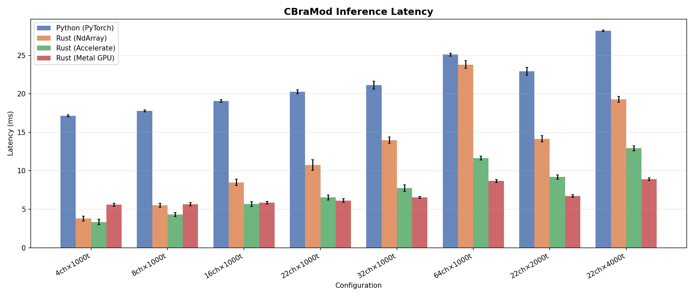
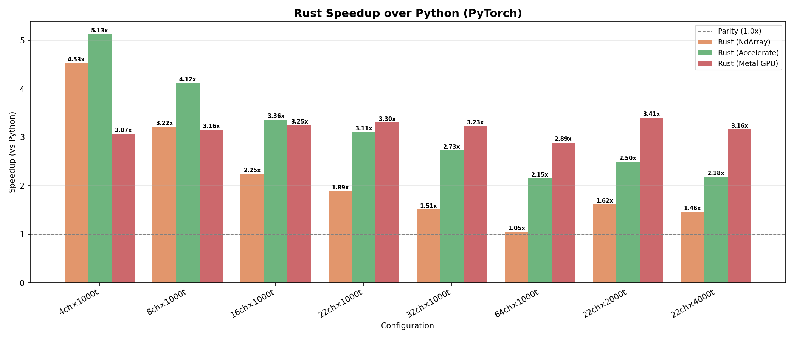
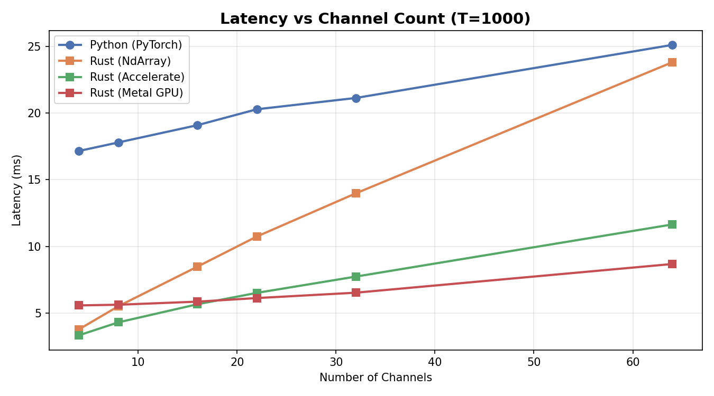
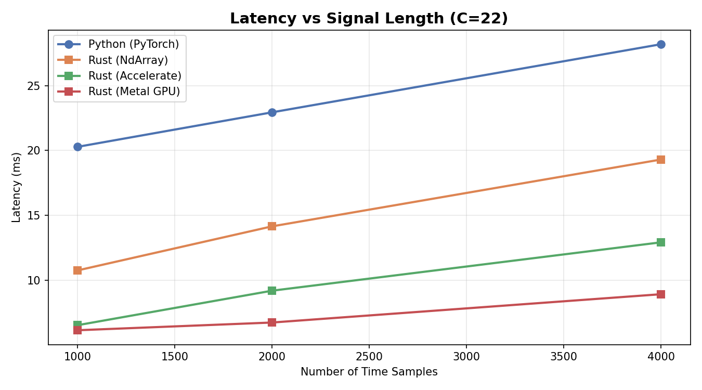

# cbramod-rs

Pure-Rust inference for the **CBraMod** (Criss-Cross Brain Model) EEG foundation model, built on [Burn 0.20](https://burn.dev).

CBraMod is a compact (~4M params) foundation model pretrained on the Temple University Hospital EEG Corpus using masked patch reconstruction. It uses **criss-cross attention** to separately model spatial (channel) and temporal (patch) dependencies.

## Architecture

```
EEG [B, C, T]
    │
    ├─ Rearrange to patches: [B, C, N, P]
    │
    ├─ Patch Embedding
    │  ├─ Conv2d pipeline (3 layers) → time-domain features
    │  ├─ FFT → abs → Linear → spectral features
    │  └─ Depthwise Conv2d → positional encoding
    │  → [B, C, N, d_model=200]
    │
    ├─ Criss-Cross Transformer (12 layers)
    │  ├─ S-Attention: self-attention across channels (spatial)
    │  └─ T-Attention: self-attention across patches (temporal)
    │  → [B, C, N, d_model]
    │
    ├─ Linear projection → [B, C, N, emb_dim]
    │
    └─ Flatten + Linear → [B, n_outputs]
```

## Quick Start

```rust
use cbramod_rs::model::cbramod::CBraMod;

let model = CBraMod::<B>::new(
    4,    // n_outputs
    22,   // n_chans
    1000, // n_times (5s @ 200Hz)
    200,  // patch_size
    800,  // dim_feedforward
    12,   // n_layers
    8,    // nhead
    200,  // emb_dim
    false, // return_encoder_output
    &device,
);

let output = model.forward(eeg_tensor); // [B, n_outputs]
```

## Benchmarks

Benchmarked on Apple M3 Max (arm64, macOS 26.3.1) with `depth=2`, `nhead=8`, `d_model=200`.
Python baseline: PyTorch 2.8.0. Rust backends: NdArray (Rayon), NdArray + Apple Accelerate BLAS, and Metal GPU (wgpu).

### Inference Latency



### Speedup vs Python



Rust is **faster than Python across all configurations**, with up to **5.13x speedup** (Accelerate, 4ch) and consistent **3–3.4x speedup** with Metal GPU.

### Channel Scaling



### Time Scaling



### Summary Table

| Configuration | Python (PyTorch) | Rust (NdArray) | Rust (Accelerate) | Rust (Metal GPU) |
|---------------|:----------------:|:--------------:|:-----------------:|:----------------:|
| 4ch × 1000t   | 17.15 ms         | **3.79 ms** (4.5x) | **3.35 ms** (5.1x) | 5.59 ms (3.1x)  |
| 8ch × 1000t   | 17.79 ms         | 5.52 ms (3.2x) | **4.32 ms** (4.1x) | 5.64 ms (3.2x)  |
| 16ch × 1000t  | 19.09 ms         | 8.49 ms (2.3x) | **5.67 ms** (3.4x) | 5.87 ms (3.3x)  |
| 22ch × 1000t  | 20.28 ms         | 10.75 ms (1.9x)| 6.53 ms (3.1x) | **6.14 ms** (3.3x) |
| 32ch × 1000t  | 21.13 ms         | 13.98 ms (1.5x)| 7.74 ms (2.7x) | **6.54 ms** (3.2x) |
| 64ch × 1000t  | 25.10 ms         | 23.80 ms (1.1x)| 11.65 ms (2.2x)| **8.69 ms** (2.9x) |
| 22ch × 2000t  | 22.94 ms         | 14.15 ms (1.6x)| 9.19 ms (2.5x) | **6.73 ms** (3.4x) |
| 22ch × 4000t  | 28.19 ms         | 19.30 ms (1.5x)| 12.92 ms (2.2x)| **8.92 ms** (3.2x) |

### Numerical Parity

Python ↔ Rust output difference: **< 3×10⁻⁶** (f32 precision limit).

## Build

```bash
cargo build --release                              # CPU (NdArray)
cargo build --release --features blas-accelerate    # macOS Accelerate
cargo build --release --no-default-features --features metal  # Metal GPU
```

## Pretrained Weights

Available on [HuggingFace](https://huggingface.co/braindecode/cbramod-pretrained).

## Citation

```bibtex
@inproceedings{wang2025cbramod,
    title     = {{CBraMod}: A Criss-Cross Brain Foundation Model for {EEG} Decoding},
    author    = {Wang, Jiquan and Zhao, Sha and Luo, Zhiling and Zhou, Yangxuan and Jiang, Haiteng and Li, Shijian and Li, Tao and Pan, Gang},
    booktitle = {The Thirteenth International Conference on Learning Representations (ICLR 2025)},
    year      = {2025},
    url       = {https://arxiv.org/abs/2412.07236}
}

@software{hauptmann2025cbramodrustinference,
    title     = {cbramod-rs: {CBraMod} {EEG} Foundation Model Inference in Rust},
    author    = {Hauptmann, Eugene},
    year      = {2025},
    url       = {https://github.com/eugenehp/cbramod-rs},
    version   = {0.0.1}
}
```

## Author

[Eugene Hauptmann](https://github.com/eugenehp)

## License

Apache-2.0
